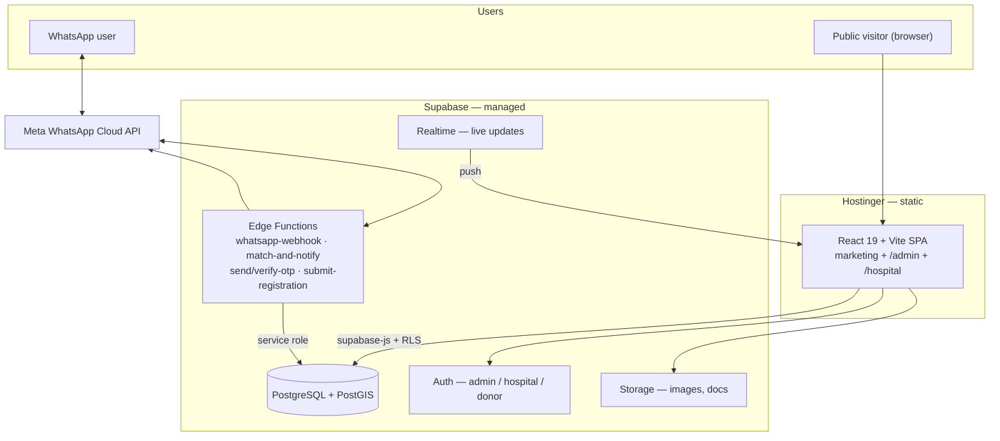
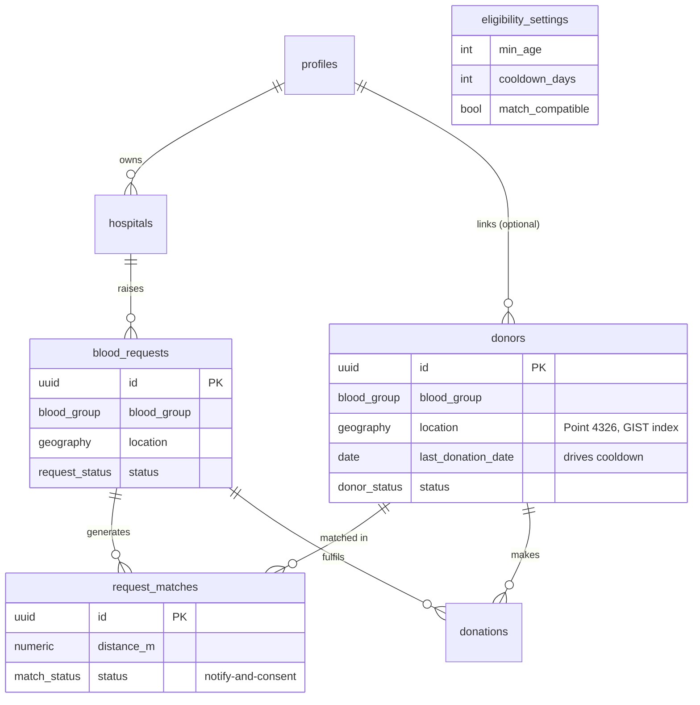
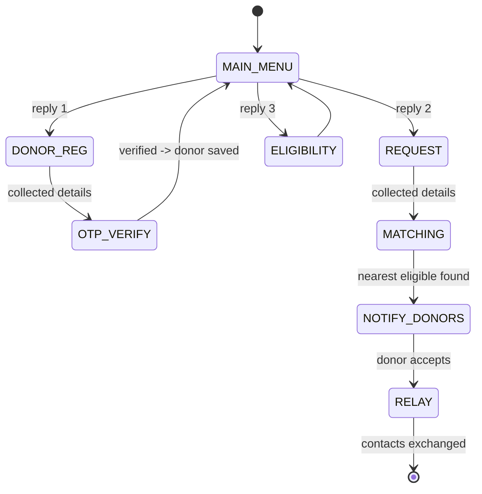

<div align="center">

# 🩸 Blood Chain Pakistan

**Together for a cause — building a nationwide culture of safe, voluntary blood donation since 2018.**

React 19 · Vite · TypeScript · Tailwind v4 · Supabase (Postgres + PostGIS) · WhatsApp Cloud API

</div>

---

## Overview

Blood Chain Pakistan (BCP) is a volunteer-run non-profit. This repository powers both the
**public website** and the **blood-registry platform** behind it:

- A marketing site (home, awards gallery, registration forms).
- A **donor / volunteer / partner registry** backed by Supabase.
- An **admin command center** and **hospital portal** (role-based).
- Geographic **nearest-eligible-donor matching** (PostGIS).
- A **WhatsApp bot** (Meta Cloud API) for 24/7 donor intake and emergency blood requests — so a
  human doesn't have to answer every message.

The platform is built **additively**: the public site keeps working exactly as before while the
backend is layered on. It is optimized for **low cost, low maintenance, and no servers to babysit**
(managed Supabase + serverless Edge Functions; the static site stays on Hostinger).

> Status: core platform built and deployable — public registration + Request Blood forms, admin command center, and geo-matching are live. The WhatsApp bot is a testing pilot; final go-live config is the remaining step. See the [Roadmap](#roadmap).

---

## Tech stack

| Layer | Choice | Why |
|---|---|---|
| Frontend | React 19, React Router v7, Vite 6, TypeScript (strict) | Fast SPA; the existing site is kept |
| Styling | Tailwind CSS v4 (tokens in `src/index.css`), `motion` | Design tokens, compositor-friendly animation |
| Backend | **Supabase** — Postgres + **PostGIS**, Auth, Storage, Realtime | Managed; no VPS; geo-native; RLS security |
| Serverless | Supabase **Edge Functions** (Deno) | WhatsApp webhook, matching, OTP, form intake |
| Messaging | **Meta WhatsApp Cloud API** (official) | Reliable; avoids `whatsapp-web.js` bans |
| Hosting | Hostinger (static `dist/`) | Already in use; zero migration |

---

## Architecture



**Security posture:** Row-Level Security is on for every table and denies by default. PII tables
(`donors`, `otp_verifications`, `whatsapp_sessions`) are server-only — public writes are brokered
by Edge Functions using the service-role key. Hospitals never read the donor table directly; they
call `find_eligible_donors()`, which returns **no contact details**. A donor's number is shared
only after they accept a request (notify-and-consent).

---

## Data model



Eligibility is **computed, never stored** (it depends on today's date): see
`find_eligible_donors()` in `supabase/migrations/`. Defaults (admin-editable): age 18–60, 90-day
cooldown, configurable request caps, min weight 50 kg.

---

## WhatsApp bot flow



Numeric menus (1/2/3) avoid free-text parsing errors entirely.

---

## Project structure

```text
src/
├── App.tsx                 # routes (public + admin + hospital + 404)
├── main.tsx                # entry
├── index.css               # Tailwind v4 theme & design tokens
├── lib/supabaseClient.ts   # browser Supabase client (publishable key)
├── types/database.ts       # DB types (regenerate via `supabase gen types`)
├── components/             # shared UI + home/ section components
├── pages/                  # route pages (Home, Gallery, Register*, NotFound, …)
└── data/                   # static content (being migrated to the DB)

supabase/
├── config.toml             # Supabase project config
├── migrations/             # versioned SQL (schema, functions, RLS)
└── seed.sql                # local dev seed
```

---

## Running locally

### Prerequisites
- **Node.js 20+** (developed on Node 24) and npm.
- **Docker Desktop** (only if you want a full local Supabase stack via `supabase start`).
- A **Supabase project** (free tier).

### 1. Install
```bash
npm install
```

### 2. Configure environment
```bash
cp .env.example .env
```
Fill in your project's values (the publishable key is safe for the browser):
```
VITE_SUPABASE_URL=https://<your-project-ref>.supabase.co
VITE_SUPABASE_PUBLISHABLE_KEY=<your-publishable-key>
```
Never put the **database password** or **service-role key** in `.env` — those belong only in
Edge Function secrets (`supabase secrets set ...`).

### 3. Database
Link the project and apply migrations (one-time setup):
```bash
npx supabase login
npx supabase link --project-ref <your-project-ref>
npx supabase db push          # applies supabase/migrations/ to the remote DB
```
Or run everything locally (needs Docker running):
```bash
npx supabase start            # spins up local Postgres + PostGIS + studio
npx supabase db reset         # applies migrations + seed.sql
```

### 4. Run the app
```bash
npm run dev                   # http://localhost:3000
```

### 5. Build for production
```bash
npm run build                 # outputs dist/  (upload contents to Hostinger public_html)
```

---

## Scripts

| Script | Purpose |
|---|---|
| `npm run dev` | Vite dev server on port 3000 |
| `npm run build` | Production build to `dist/` |
| `npm run preview` | Preview the production build |
| `npm run typecheck` | `tsc --noEmit` (strict) |
| `npm run lint` | ESLint |
| `npm run format` | Prettier write |

---

## Deployment (Hostinger)

1. `npm run build`.
2. Upload the **contents of `dist/`** to `public_html`.
3. `public/.htaccess` (copied into `dist/`) provides the SPA fallback (deep links survive refresh),
   forces HTTPS, and sets security headers.
4. Supabase and Edge Functions are deployed separately (managed cloud); only the static frontend
   lives on Hostinger.

---

## Roadmap

| Sprint | Scope | Status |
|---|---|---|
| 0 | Setup & guardrails: strict TS, ESLint/Prettier, dep cleanup, 404, SPA `.htaccess`, SEO/OG, Supabase wiring | ✅ Done |
| 1 | Database foundation: PostGIS, schema, RLS, matching function, types | ✅ Done |
| 2 | Web registry: forms → DB (dead volunteer/partner forms fixed), geocoding, +92 phone & CNIC validation (UI + DB), honeypot anti-spam | ✅ Done |
| 3 | Admin command center: donor search by group + proximity, Team/FAQ CMS, analytics, volunteer follow-up funnel | ✅ Done |
| 4 | Geo matching + request flow: public Request Blood form, alert/fulfill relay with pre-filled WhatsApp, donation cooldown | ✅ Done · hospital portal + Realtime ⬜ pending |
| 5 | WhatsApp bot: whatsapp-web.js **pilot scaffolded** (`whatsapp-bot/`); official Meta Cloud API for production | 🚧 Pilot |
| 6 | Hardening (Supabase advisor fixes, honeypot, RLS perf), generic CI + hardened deploy, Playwright QA, docs | 🚧 In progress |

Out of scope (future): iOS/Android apps, hospital ERP integration, live map navigation, SMS failover.

---

## Security & privacy

- RLS enabled on all tables; deny-by-default; PII tables server-only.
- Secrets in env / Edge Function secrets only — never committed. Publishable key is the only
  Supabase value that reaches the browser.
- Donor health data is handled under explicit consent; contact details are shared only on a
  donor's per-request acceptance.

## License

© Blood Chain Pakistan. All rights reserved. Internal project — not for redistribution without permission.
